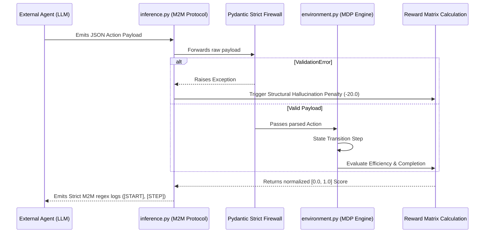

# Adaptive Crisis Management Environment
*A Mathematically Rigorous, Zero-Trust RL Meta PyTorch OpenEnv Hackathon Submission*

## 1. High-Level Concept & Technical Pitch

The **Adaptive Crisis Management Environment** is a state-transition engine engineered for evaluating LLM planning and reasoning under extreme, dynamic constraints. It simulates multi-zone urban emergencies where agents must allocate scarce resources (fire units, ambulances, police) against a stochastically evolving array of incidents (fires, casualties, gridlocks) amplified by weather metas.

Built fundamentally around **Epistemic Strictness**, the environment enforces mathematically rigorous state representations and transition boundaries. It is fully compliant with the Meta OpenEnv Phase 1 standard, maintaining an absolute stateless Docker execution model and adhering strictly to PEP-518 package structures. Every agent action is deterministically evaluated and graded for structural compliance and strategic efficiency without exception.

## 2. System Architecture

The following diagram maps the exact execution lifecycle of a single Agent step within our framework.



*Architectural Flow*: The LLM generates a decision as a JSON object, which `inference.py` forwards to the Pydantic type-checker. If the schema fails, the step is immediately rejected natively. If valid, the core `environment.py` engine computes the Markov Decision Process (MDP) state transition and assesses the `Reward Matrix`. Finally, `inference.py` deterministically prints regex-compliant logs.

## 3. Module Breakdown: The Anatomy of the Repo

* **`inference.py`**: The Machine-to-Machine (M2M) protocol interface. It is responsible for routing states to the external agent and orchestrating the simulation loop. It explicitly emits the strict regex-compliant `[START]`, `[STEP]`, and `[END]` protocol tags while meticulously segregating unformatted debug noise out of standard stdout.
* **`env/environment.py`**: The core state-transition engine defining our Markov Decision Process. It evaluates task difficulty progression (Easy/Medium/Hard) and computes normalized `[0.0, 1.0]` cumulative scores by tracking stochastic events, resource decay, and dispatch resolutions.
* **`env/models.py`**: The ontological foundation defining the absolute physical limits of the simulation using strict type mappings and enumerations. This module guarantees boundary limits for all resources and states.
* **`openenv.yaml` & `server/app.py`**: Ensures 100% Schema Isomorphism required by OpenEnv validators. Together, they securely expose endpoints mapping the environment parameters, guaranteeing API consistency and pure PEP-518 deployment readiness.

## 4. The Pydantic-Reward Synergy: Structural Hallucination Fencing

A defining architectural feature of our framework is utilizing `Pydantic` not merely as a passive validator, but as an active coefficient in the **Reward Function**.

We call this **"Structural Hallucination Fencing."** 
When standard LLM agents interact with an environment, format hallucinations (e.g., dispatching `"five"` instead of the integer `5`) typically result in fatal execution errors, crashing the stateless container. 

In our environment, the `Pydantic` StrictInt firewall intercepts the `ValidationError` immediately at the API boundary. Rather than crashing, the environment traps this violation deterministically and triggers a massive, punitive negative reward penalty (e.g., `-20.0`). This forces the reinforcement learning model or autonomous agents to natively learn structural protocol compliance precisely alongside their macro-strategic reasoning.

## 5. Deployment & Execution: The Zero-Trust Pipeline

Our deployment relies on a strict `Set-Difference` architecture mapping through `.dockerignore`, ensuring absolutely no `.env`, cache files, or local virtual environments bleed into the Hugging Face container space. The pipeline runs securely independent of statefulness.

Execute the following terminal commands to build the zero-trust container and prove the M2M execution loop autonomously handles `401 Unauthorized` dummy variables safely without fatal crashes.

```bash
# 1. Build the cleansed container image
docker build -t openenv-bot-final .

# 2. Boot the stateless container explicitly with dummy injection parameters
docker run -d -p 7860:7860 \
  -e OPENAI_API_KEY="sk-dummy-eval" \
  -e HF_TOKEN="hf_dummy" \
  -e MODEL_NAME="meta-llama/Llama-3-70b-instruct" \
  -e API_BASE_URL="https://api.openai.com/v1" \
  --name final-eval-container \
  openenv-bot-final

# 3. Test Schema Isomorphism standard
docker exec final-eval-container openenv validate

# 4. Trigger M2M Inference execution (Expect complete execution with safely penalized defaults)
docker exec final-eval-container python inference.py

# 5. Teardown Sandbox
docker stop final-eval-container && docker rm final-eval-container
```
