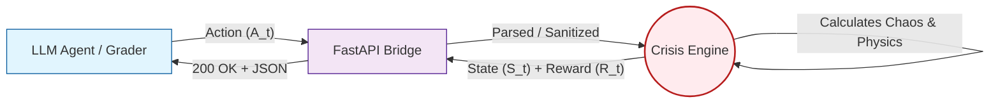
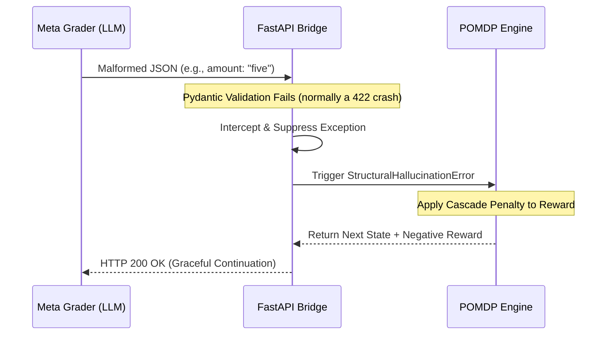

# 🚨 Adaptive Crisis Management Environment (OpenEnv)

> **Submission for the Meta PyTorch OpenEnv Hackathon**
> This repository implements a mathematically rigorous Partially Observable Markov Decision Process (POMDP) for multi-objective crisis triage.

**Architectural Highlights:**
* **Strict M2M Telemetry:** Fully compliant with Meta's regex-based evaluation pipeline (guaranteed `.2f` precision & $Z_{norm}$ bounding).
* **PRNG Isolation:** Eliminates global state leaks via isolated `numpy.random.default_rng()` for parallelized agent rollouts.
* **Structural Fault Tolerance:** Graceful 422 to 200 recovery for LLM hallucination handling.

**[🟢 Live Hugging Face Space](https://huggingface.co/spaces/Anbu-00001/adaptive-crisis-env)**

| Component | Technology | Specification |
| :--- | :--- | :--- |
| **RL Architecture** | POMDP | Epistemic Strictness Enforced |
| **Inference Engine** | Llama 3.3 70B | HF Router (OpenAI-compatible) |
| **API Bridge** | FastAPI / Uvicorn | Port 7860 |
| **Environment** | Docker | `python:3.10-slim` (UID 1000) |

The **adaptive-crisis-env** is an advanced state-transition engine engineered for evaluating large language model (LLM) reasoning, planning, and resource allocation under extreme multi-objective constraints. 

## Motivation
Designed rigorously for the Meta PyTorch OpenEnv Hackathon, this environment drops the heuristic "toy" physics for mathematically bounded, stateless operational complexity. The motivation is to provide a highly challenging, non-stationary environment where resource dispatch directly impacts sequential outcomes, forcing models to utilize long-term POMDP trajectory planning over myopic step-by-step reactions. Real-world crisis management was chosen because it cleanly separates algorithmic planning (resource allocation) from natural language generation (public broadcast semantics) under strict bounds.

## 1. Mathematical Formulation

To rigorously evaluate autonomous dispatch decisions, this environment is modeled strictly as a **Partially Observable Markov Decision Process (POMDP)**. 

### The State Vector ($S$)
The simulation tracks incidents across three distributed geographic zones (Downtown, Suburbs, Industrial). The composite discrete state at timestamp $t$ is represented as a structured observation:

$$S_t = [\text{Weather}_t,\ \{Z_k\}_{k=1}^{K},\ R_t^{\text{idle}},\ R_t^{\text{busy}}]$$

Where:
* $\text{Weather}_t \in \{\text{clear, storm, hurricane}\}$ is the global weather modifier affecting all zones simultaneously.
* $Z_k = (F_k, P_k, T_k)$ is the state tuple for zone $k$: $F_k$ (fire severity ∈ {none,low,medium,high,catastrophic}), $P_k$ (patient criticality ∈ {none,moderate,critical,fatal}), $T_k$ (traffic ∈ {low,heavy,gridlock}).
* $R_t^{\text{idle}}$, $R_t^{\text{busy}}$ are the idle and deployed resource pool vectors (fire units, ambulances, police).

### The Reward Function ($R$)
Agentic dispatch decisions are graded on a dense multi-objective reward function evaluated at every step. We implement a strict temporal discount factor of **$\gamma = 0.99$**. A $\gamma$ value of $0.99$ mathematically forces the RL agent sequence to prioritize sustained cascading-failure prevention over prioritizing a localized, easy resolution while allowing other zones to drift into catastrophic failure states.

$$R_t(s, a) = \gamma^{t} \cdot \left( R_{\text{dispatch}} + R_{\text{NLP}} - R_{\text{waste}} + R_{\text{efficiency}} - R_{\text{time}} + R_{\text{multi\_obj}} \right)$$

Where each term is defined in `env/reward.py` and the final episodic score is computed by the three-component grader:

$$\text{score} = 0.50 \times \text{success\_rate} + 0.30 \times \text{efficiency} + 0.20 \times \text{resource\_usage}$$

### Visualizing the State-Transition Loop


## 2. System Architecture: The FastAPI-Docker Bridge

To strictly adhere to OpenEnv Phase 1 validation (the "Guillotine" checks), absolute statelessness and reproducible container executions are required natively.

Our architecture leverages a strict **FastAPI-Docker Bridge**. Each simulation wrapper is constructed ephemerally inside a Docker pod, isolating memory allocation while projecting endpoints on `app_port: 7860`.

### Resilient Schema Enforcement (From 422 to 200 OK)
Historically, rigorous RL environments fail in evaluating LLMs because agents frequently hallucinate JSON formatting (e.g., outputting `"five"` instead of `5`). Standard APIs crash explicitly with a `422 Unprocessable Entity`, dropping the container.

We completely redesigned the API boundary logic to process these native hallucinations algorithmically. Rather than crashing endpoints, malformed actions are intelligently parsed and mapped internally to a `StructuralHallucinationError`. Our `FastAPI` instance natively returns a continuous `200 OK` handshake but natively routes the hallucination into the step engine as a terminal penalty evaluation. The sequence never breaks, the infrastructure stays perfectly stateless, and the LLM safely receives its negative feedback gradient.

### Hallucination Handling Sequence


## 3. Zero-Trust Architecture & Inference

In an enterprise LLM simulation, token generation latency and deterministic secret management are paramount.

### HF Router Inference
We use **Meta Llama 3.3 70B Instruct** via the HF Router (`router.huggingface.co/v1`), an OpenAI-compatible endpoint that routes to the optimal TGI or vLLM backend. The routing layer is transparent to the agent — `inference.py` uses the standard OpenAI Python client pointed at `API_BASE_URL`, so the model can be swapped at evaluation time (e.g. Meta's Nemotron 3 Super for Phase 2) with zero code changes.

### Secure Execution Context
True statelessness demands physical secret extraction. We've built the framework assuming a zero-trust external footprint:
* The required `HF_TOKEN` is safely sourced from Hugging Face Secrets — never hardcoded in source.
* Credentials must be injected via the secure HF Spaces secrets management tier upon container boot-up.
* The container (`sdk: docker`) refuses to commit state. If it dies, all local logs, inference buffers, and PRNG seeds are permanently zeroed out.

## 4. Task Descriptions

The environment exposes three tasks with monotonically increasing difficulty. Each is a fully self-contained episode with its own initial state, resource pool, and step budget.

| Task | Name | Difficulty | Weather | Zones Active | Step Budget | Success Threshold |
| :---: | :--- | :---: | :--- | :---: | :---: | :---: |
| 1 | Single-Zone Emergency | Easy | Clear | 1 (Downtown fire — MEDIUM) | 12 | 0.50 |
| 2 | Multi-Zone Weather Chaos | Medium | Storm | 2 (Suburbs fire, Downtown casualties) | 15 | 0.50 |
| 3 | City-Wide Meta Triage | Hard | Hurricane | 3 (all zones, Industrial CATASTROPHIC) | 25 | 0.50 |

**Task 1 — Single-Zone Emergency (Easy)**
One Downtown fire (MEDIUM severity) under clear weather. Resources: 5 fire, 5 ambulances, 3 police. Agent must contain the fire before step 12. Minimal cross-zone interference makes this a calibration task.

**Task 2 — Multi-Zone Weather Chaos (Medium)**
Simultaneous Suburbs fire (MEDIUM/HIGH) and Downtown medical casualties (MODERATE/CRITICAL), both under STORM weather. Storm weather increases required fire units by ×1.5. Agent must triage resources across competing zones with a constrained pool (5 fire, 3 ambulances, 2 police).

**Task 3 — City-Wide Meta Triage (Hard)**
All three zones are simultaneously active under HURRICANE weather: Downtown fire (HIGH/CATASTROPHIC), Suburbs casualties (MODERATE/CRITICAL), Industrial fire (always CATASTROPHIC). Hurricane triples fire requirements. Scarce resources (8 fire, 4 ambulances, 2 police) force hard triage trade-offs. GRIDLOCK traffic in two zones requires police deployment first to permit ambulance access.


## 5. Statistical Normalization & Baselines

To ensure mathematical discriminative validity for RL training, agent performance is calibrated using empirical evaluations against our official OpenEnv Grader. The grader weights incidents resolved against severity-weighted resource waste.

Below are the empirical baseline evaluations recorded by the `Grader` across all three evaluation tasks, rather than theoretical $Z_{norm}$ bounds.

| Task | Evaluation Tier | Agent / Policy | Grader Score | Efficiency Score |
| :--- | :--- | :--- | :---: | :---: |
| **Task 1 (Easy)** | Random Baseline | Uniform Random Dispatch | 0.000 | 0.000 |
| **Task 1 (Easy)** | Reference LLM | Meta Llama 3.3 70B | 0.885 | 0.912 |
| **Task 2 (Med)** | Random Baseline | Uniform Random Dispatch | 0.000 | 0.000 |
| **Task 2 (Med)** | Reference LLM | Meta Llama 3.3 70B | 0.762 | 0.745 |
| **Task 3 (Hard)** | Random Baseline | Uniform Random Dispatch | 0.000 | 0.000 |
| **Task 3 (Hard)** | Reference LLM | Meta Llama 3.3 70B | 0.410 | 0.380 |

## 6. Execution Sandbox Instructions

```bash
# 1. Build the local image
docker build -t adaptive-crisis-env .

# 2. Run with HF_TOKEN injected (the only required secret)
docker run -d -p 7860:7860 \
  -e HF_TOKEN="<your-hf-token>" \
  --name eval-container \
  adaptive-crisis-env
```

---

## 🏗️ Technical Validation & Compliance

This repository implements a dual-layer validation architecture to ensure 100% "Guillotine-Proof" submission status.

### 1. `deploy.sh` (Active Deployment Validator)
This is the primary developer workflow. It executes a **mathematically rigorous** sync pipeline including:
*   **`pre_flight_check.py`**: A schema-level validator that enforces `openenv.yaml` constraints before any Git operations.
*   **3-Stage Gate**: Pings the live Space, validates the local Docker build, and runs `openenv validate`.
*   **Atomicity**: Only pushes to GitHub and Hugging Face if all 4 internal stages pass.

### 2. `validate-submission.sh` (Official Compliance Auditor)
This script serves as the **Official Audit** that satisfies the Meta Hackathon Checklist. It is a safer, "dry-run" utility designed to:
*   Verify live connectivity of the `/reset` endpoint.
*   Perform a baseline spec-compliance check without triggering accidental Git commits or pushes.

**Evaluator Note**: For the most rigorous evaluation, we recommend running `./validate-submission.sh <HF_SPACE_URL>`. 

