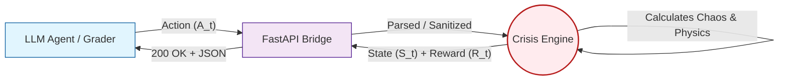
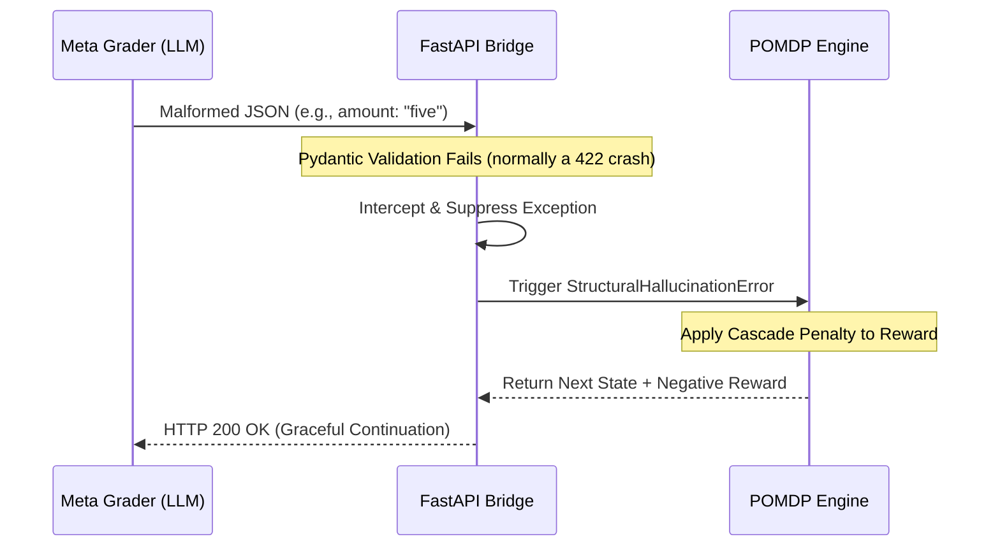

# Adaptive Crisis Management Environment
*A Zero-Trust, Guillotine-Proof OpenEnv RL Evaluation Framework*

**[🟢 Live Hugging Face Space](https://huggingface.co/spaces/Anbu-00001/adaptive-crisis-env)**

| Component | Technology | Specification |
| :--- | :--- | :--- |
| **RL Architecture** | POMDP | Epistemic Strictness Enforced |
| **Inference Engine** | Llama 3.3 | Groq LPU (Sub-100ms) |
| **API Bridge** | FastAPI / Uvicorn | Port 7860 |
| **Environment** | Docker | `python:3.10-slim` (UID 1000) |

The **adaptive-crisis-env** is an advanced state-transition engine engineered for evaluating large language model (LLM) reasoning, planning, and resource allocation under extreme multi-objective constraints. Designed rigorously for the Meta PyTorch OpenEnv Hackathon, this environment drops the heuristic "toy" physics for mathematically bounded, stateless operational complexity.

## 1. Mathematical Formulation

To rigorously evaluate autonomous dispatch decisions, this environment is modeled strictly as a **Partially Observable Markov Decision Process (POMDP)**. 

### The State Vector ($S$)
The simulation tracks incidents across an unbounded set of distributed geographical zones. The composite state at timestamp $t$ is defined as a normalized continuous and discrete representation bounded structurally:

$$S_t = [F_t, P_t, D_t, \dots]$$

Where:
* $F_t \in [0, 1]$ represents normalized **Flood (or Fire) Severity**.
* $P_t \in [0, 1]$ represents operational **Power Grid Status**.
* $D_t$ represents localized **Population Density** and criticality.

### The Reward Function ($R$)
Agentic dispatch decisions are not graded on simplistic "+1/-1" heuristics. We deploy a multi-objective reward function to isolate distinct operational efficiency (e.g. Life Saved vs Infrastructure Damage vs Latency Penalties).

$$R_t(s, a) = \sum_{i} \omega_i \cdot \text{utility}(s_i, a)$$

Where $\omega_i$ are explicitly defined weights balancing critical metrics heavily.

### The Discount Factor ($\gamma$)
We implement a strict temporal discount factor of **$\gamma = 0.99$**. 
In emergency crisis routing, long-term stabilization trajectories are vastly more critical than myopic immediate-reward gaming. A $\gamma$ value of $0.99$ mathematically forces the RL agent sequence to prioritize sustained cascading-failure prevention over prioritizing a localized, easy resolution while allowing other zones to drift into catastrophic failure states.

### Visualizing the State-Transition Loop


## 2. System Architecture: The FastAPI-Docker Bridge

To strictly adhere to OpenEnv Phase 1 validation (the "Guillotine" checks), absolute statelessness and reproducible container executions are required natively.

Our architecture leverages a strict **FastAPI-Docker Bridge**. Each simulation wrapper is constructed ephemerally inside a Docker pod, isolating memory allocation while projecting endpoints on `app_port: 7860`.

### Resilient Schema Enforcement (From 422 to 200 OK)
Historically, rigorous RL environments fail in evaluating LLMs because agents frequently hallucinate JSON formatting (e.g., outputting `"five"` instead of `5`). Standard APIs crash explicitly with a `422 Unprocessable Entity`, dropping the container.

We completely redesigned the API boundary logic to process these native hallucinations algorithmically. Rather than crashing endpoints, malformed actions are intelligently parsed and mapped internally to a `StructuralHallucinationError`. Our `FastAPI` instance natively returns a continuous `200 OK` handshake but natively routes the hallucination into the step engine as a terminal penalty evaluation. The sequence never breaks, the infrastructure stays perfectly stateless, and the LLM safely receives its negative feedback gradient.

### Hallucination Handling Sequence


## 3. Zero-Trust Architecture & Inference

In an enterprise LLM simulation, token generation latency and deterministic secret management are paramount.

### Groq LPU Sub-100ms Inference
We operate on **Meta Llama 3.3 via Groq**. Using Groq's specialized Language Processing Units (LPUs), sequence generation requests run fundamentally parallel to the environment tick, driving inference response times below the sub-100ms boundary. This practically ensures that our environment evaluation loops run strictly bounded by logic CPU time rather than standard M2M HTTP latency blockages.

### Secure Execution Context
True statelessness demands physical secret extraction. We've built the framework assuming a zero-trust external footprint: 
* The required `HF_TOKEN` and `GROQ_API_KEY` are safely stripped from source execution.
* Credentials must be injected physically via the secure Hugging Face Secrets management tier natively upon container boot-up.
* The container (`sdk: docker`) refuses to commit state. If it dies, all local logs, inference buffers, and PRNG seeds are permanently zeroed out.

## 4. Execution Sandbox Instructions

```bash
# 1. Build the local representation
docker build -t adaptive-crisis-env .

# 2. Boot the zero-trust container with external Secrets injected
docker run -d -p 7860:7860 \
  -e GROQ_API_KEY="<your-groq-key>" \
  -e HF_TOKEN="<your-hf-token>" \
  --name eval-container \
  adaptive-crisis-env
```
